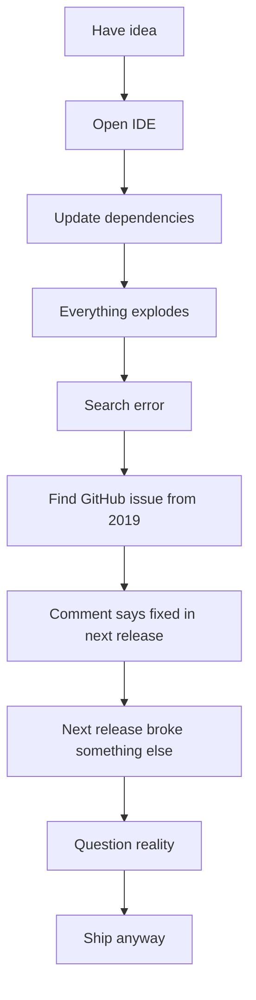

<!--
  Welcome to the README.
  Please keep arms, legs, and runtime exceptions inside the vehicle at all times.
-->

<div align="center">

# Huxley Mc

### Android gremlin. Kotlin enjoyer. TypeScript survivor. React Native hostage.


<br />


</div>

---

## `whoami`

```bash
$ whoami
huxley

$ echo $STACK
Android / Kotlin / TypeScript / React Native

$ echo $STATUS
"works on my machine" certified

$ echo $LOCATION
Australia, probably fighting Gradle somewhere
```

I build mobile apps, break mobile apps, fix mobile apps, then wonder why the build cache is 47GB.

My natural habitat is somewhere between:

- writing Kotlin that looks clean until the product manager enters the room
- explaining that React Native is not just “React but phone”
- staring at a failing CI job that passes locally because computers are haunted
- creating side projects that definitely will not consume my entire weekend
- pushing tiny fixes with commit messages like `final final actual fix`

---

## Current build status

```txt
Mental Build:        FAILED
Gradle Build:        MAYBE
TypeScript Build:    COMPLAINING
Android Studio:      INDEXING FOREVER
Coffee Dependency:   REQUIRED
```

---

## Tech stack, but cursed

| Thing | Relationship status |
| --- | --- |
| Kotlin | Healthy, stable, emotionally available |
| Android | Long-term relationship with occasional crash reports |
| TypeScript | Toxic but useful |
| React Native | “It should work on both platforms” famous last words |
| Gradle | Ancient forbidden machinery |
| GitHub Actions | YAML-flavoured roulette |
| npm | Downloads the entire internet to render a button |

---

## Skills unlocked

```kotlin
class Huxley : Developer() {
    val languages = listOf(
        "Kotlin",
        "TypeScript",
        "JavaScript",
        "Whatever config file this is"
    )

    val specialties = listOf(
        "Android apps",
        "React Native apps",
        "Making UI behave",
        "Turning caffeine into APKs",
        "Debugging bugs I created 4 minutes ago"
    )

    fun shipFeature() {
        while (testsAreFailing()) {
            blameCache()
            cleanBuild()
            questionCareer()
        }

        println("LGTM 🚀")
    }
}
```

---

## Featured nonsense

### Steam-Spotify

> Shows what song you're listening to on Steam.

Because sometimes people need to know you are gaming while emotionally listening to Spotify.

```txt
Game: open
Music: sad
Presence: updated
Vibe: immaculate
```

### gh-trending

> API for fetching trending GitHub repositories and developers.

For when you want to know what everyone else is building instead of finishing your own projects.

```txt
Trending repos found: 100
Ideas stolen ethically: 7
Projects completed: 0
```

---

## GitHub stats, also known as public shame

<div align="center">


</div>

---

## My development workflow



---

## Things I say too often

```txt
"Why is this null?"
"That should not be possible."
"Let me just clean rebuild."
"It is probably a cache issue."
"Who wrote this?"
"Oh. I wrote this."
"React Native moment."
"Gradle is doing Gradle things."
```

---

## `npm install personality`

```json
{
  "name": "huxley",
  "role": "mobile-developer",
  "main": "probably/MainActivity.kt",
  "scripts": {
    "start": "open android studio and pray",
    "build": "gradle assembleDebug --vibes",
    "test": "pretend to write tests",
    "deploy": "panic"
  },
  "dependencies": {
    "kotlin": "latest-but-not-too-latest",
    "typescript": "strict-until-annoying",
    "react-native": "works-eventually",
    "coffee": "peerDependency"
  },
  "devDependencies": {
    "stack-overflow": "legacy",
    "github-issues": "unstable",
    "rubber-duck": "required"
  }
}
```

---

## Contact

<div align="center">

[](https://huxleymc.dev)
[](https://github.com/HuxleyMc)

</div>

---

<div align="center">

### Thanks for visiting.

Please leave a star, a follow, or a detailed explanation of why Android Studio needs 9GB of RAM to render sadness.

```txt
            /\_/\
           ( o.o )
            > ^ <
    mobile dev detected
```

</div>
